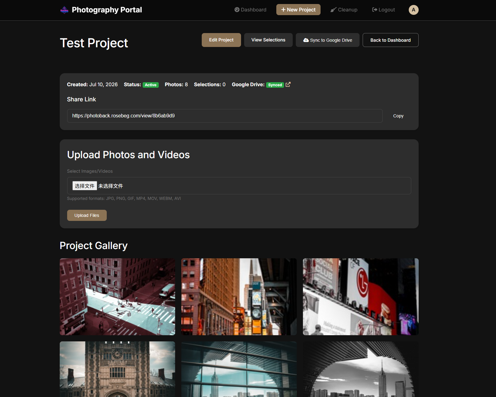
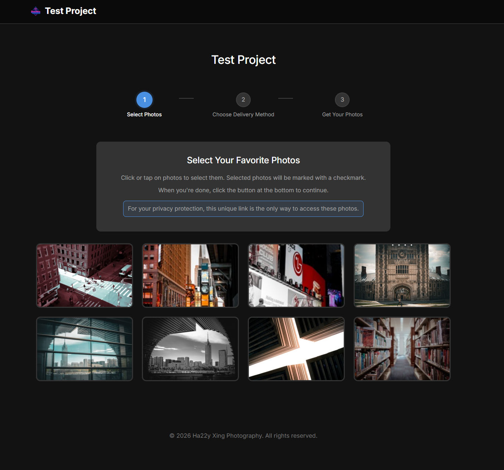
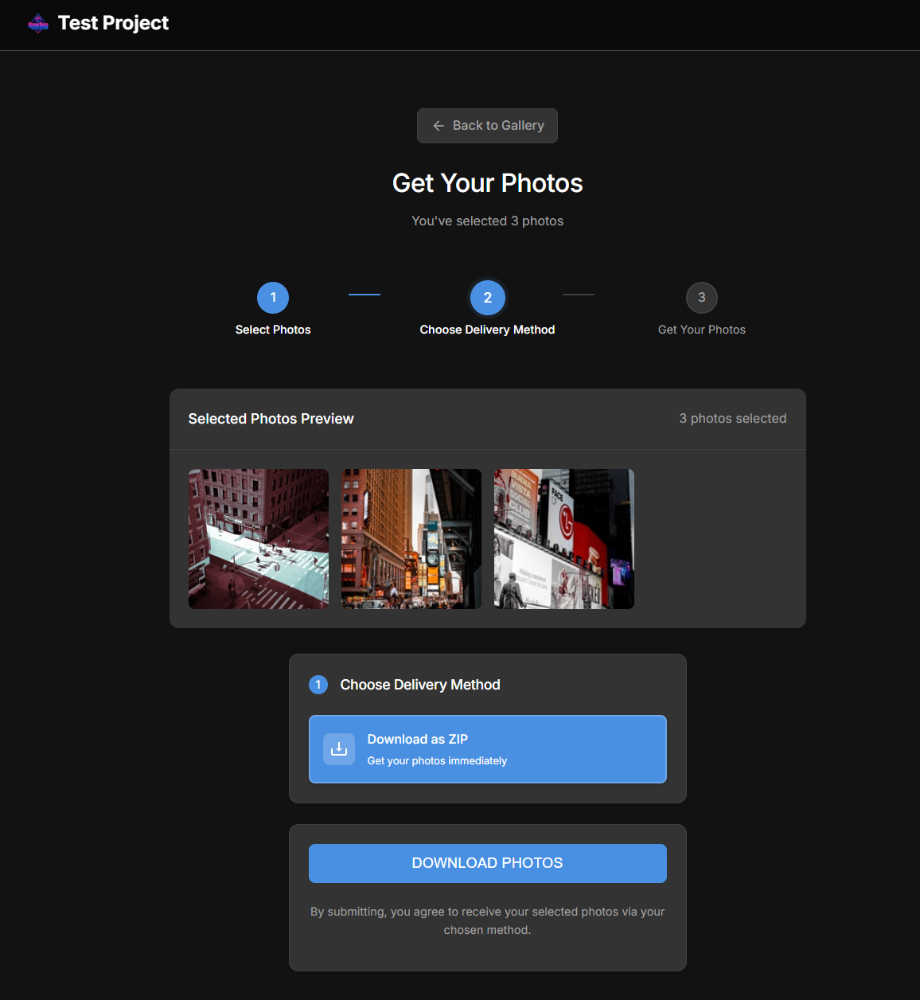

<h1 align="center">PhotoBack</h1>

<p align="center">
  A self-hosted photography delivery platform for event galleries, private-by-link sharing, client selections, and Google Drive backup.
</p>

<p align="center">
  <a href="README.zh-CN.md">Chinese</a> &middot;
  <a href="https://photoback.rosebeg.com/view/8b6ab9d9">Visitor Demo Page</a> &middot;
  <a href="#product-preview">Preview</a> &middot;
  <a href="#quickstart">Quickstart</a> &middot;
  <a href="#how-google-drive-backup-works">Google Drive Backup</a>
</p>

<p align="center">
  <a href="https://github.com/Ha22yX/PhotoBack"></a>
  
  
  
  
  
</p>

<p align="center">
  
</p>

## Product Preview

<table>
  <tr>
    <td>
      
    </td>
  </tr>
  <tr>
    <td><strong>Admin project workspace.</strong> Create an event project, upload photos/videos, copy the visitor link, and verify Google Drive sync status from the same page.</td>
  </tr>
</table>

<table>
  <tr>
    <td width="50%">
      
    </td>
    <td width="50%">
      
    </td>
  </tr>
  <tr>
    <td><strong>Visitor gallery.</strong> Guests open the unique project URL and choose favorite photos.</td>
    <td><strong>Delivery step.</strong> Selected photos can be downloaded, emailed, shared as a link, or handed off through Google Drive.</td>
  </tr>
</table>

## Why This Exists

PhotoBack was built around a real photographer workflow: after an event, create a project, upload the edited media, share one clean link with attendees, and let them select or download the photos they need.

The project is intentionally narrow. It is not a generic cloud album. It is a self-hosted delivery desk for photographers who want control over their own website, local files, client links, and optional cloud backup.

## Project History

PhotoBack was originally built for my own photography workflow and has been used in private deployments for the past two to three years. This repository is the cleaned public release, with runtime photos, database files, OAuth tokens, SMTP secrets, and local deployment config removed before open-sourcing.

## Features

- Project-based galleries with unique access links such as `/view/<access_link>`.
- Admin dashboard for project status, client info, uploads, selections, cleanup, and Drive sync.
- Batch upload for photos and videos, with generated thumbnails and image optimization.
- Visitor-side selection flow with preview, selected-photo review, and delivery choice.
- Delivery options: ZIP download, email delivery, generated share link, or Google Drive collection.
- Google Drive backup workflow: project folders, per-photo file IDs, manual full sync, and synced status.
- Public-release hygiene: runtime uploads, SQLite database files, OAuth tokens, SMTP secrets, and local instance config are ignored.

## Tech Stack

| Layer | Technology | Purpose |
| --- | --- | --- |
| Backend | Python, Flask | Project workflow, routes, uploads, admin and visitor pages |
| Data | SQLite, SQLAlchemy, Flask-Migrate | Projects, photos, selections, Drive IDs, and admin users |
| Frontend | Jinja templates, CSS, JavaScript | Admin dashboard, gallery grid, selection and delivery UI |
| Media | Pillow, optional ffmpeg | Image optimization, thumbnails, and video preview frames |
| Delivery | SMTP, ZIP generation, Google Drive API | Email delivery, downloads, share links, and cloud handoff |

## How Google Drive Backup Works

When Google Drive is configured, PhotoBack keeps two copies of project media:

1. The original local upload is saved under the configured upload folder and recorded in SQLite.
2. Project creation attempts to create or resolve a matching Google Drive project folder.
3. After each local upload succeeds, PhotoBack calls `sync_photo_upload(photo)` to upload the media to the Drive folder and store the returned `drive_file_id`.
4. The admin page also exposes a manual `Sync to Google Drive` action that runs a full project sync for existing photos.
5. If Drive sync fails, the local upload still succeeds and the UI returns a warning instead of losing the uploaded files.

This makes Google Drive a backup and sharing layer rather than the only storage layer. For deployment, keep the OAuth token outside Git and provide it through the local instance path.

## Quickstart

```bash
git clone https://github.com/Ha22yX/PhotoBack.git
cd PhotoBack
python -m venv .venv

# Windows PowerShell
.venv\Scripts\activate

# macOS/Linux
# source .venv/bin/activate

pip install -r requirements.txt
copy .env.example .env
flask --app run.py db upgrade
python run.py
```

Open `http://localhost:5000/admin` after creating an admin user.

There is no public registration route in this backup. Create the first admin from a Flask shell:

```bash
flask --app run.py shell
```

```python
from app import db
from app.models import User

user = User(username="admin", email="admin@example.com")
user.set_password("change-this-password")
db.session.add(user)
db.session.commit()
```

## Configuration

Copy `.env.example` to `.env` and update the values for your deployment:

| Variable | Purpose |
| --- | --- |
| `SECRET_KEY` | Flask session and CSRF signing key |
| `SITE_URL` | Public base URL used when generating share links |
| `DATABASE_URL` | SQLAlchemy database URL, SQLite by default |
| `SMTP_SERVER`, `SMTP_PORT`, `SMTP_USERNAME`, `SMTP_PASSWORD` | Email delivery settings |
| `EMAIL_DOMAIN`, `SUPPORT_EMAIL` | Public email domain and support contact for outbound messages |
| `GOOGLE_CLIENT_ID`, `GOOGLE_CLIENT_SECRET`, `GOOGLE_PROJECT_ID` | Optional Google Drive OAuth app settings |
| `MAX_UPLOAD_MB` | Maximum request size for uploads |

For Google Drive sync, place the generated OAuth token outside version control, preferably at `instance/google_token.json`. The repository ignores token files by design.

## How It Works

1. The photographer creates a project in the admin dashboard.
2. PhotoBack generates a unique access key for the visitor gallery.
3. The photographer uploads photos or videos into the project.
4. If Drive is configured, uploads are backed up to the matching Google Drive folder.
5. Visitors open the shared link, select images, and choose a delivery method.
6. The photographer reviews selections and can resend, download, or sync project files.

## Project Layout

```text
app/
  admin/       Admin dashboard, uploads, cleanup, Google Drive sync
  client/      Visitor gallery, selection, download, share, Drive handoff routes
  static/      CSS, JavaScript, logos, runtime upload folder
  templates/   Admin and visitor HTML templates
  utils/       Email, image, video, and file helpers
migrations/    Flask-Migrate database migrations
run.py         Local development entry point
```

## Security Notes

The unique project link is useful for event delivery, but it is not the same as account-based access control. For sensitive galleries, add expiration, passwords, or authenticated accounts.

This public repository is cleaned for release. Runtime photos, SQLite databases, SMTP passwords, Google OAuth tokens, and local instance config are intentionally not committed.

## Roadmap

- Add a first-run admin creation command.
- Add Docker deployment files.
- Add optional project expiration or password protection.
- Add automated tests around upload, selection, Drive sync, and download flows.

## License

MIT License. Commercial use, modification, distribution, and private use are allowed.
