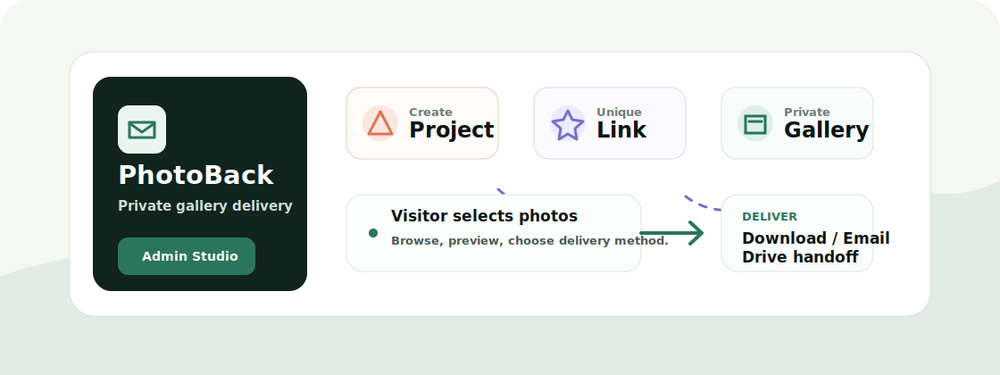

<h1 align="center">PhotoBack</h1>

<p align="center">
  A self-hosted photography delivery platform for creating private event galleries, sharing one unique link, and collecting client selections.
</p>

<p align="center">
  <a href="README.zh-CN.md">中文版本</a> &middot;
  <a href="https://photoback.rosebeg.com/view/8b6ab9d9">Live visitor route</a> &middot;
  <a href="#quickstart">Quickstart</a> &middot;
  <a href="#features">Features</a>
</p>

<p align="center">
  <a href="https://github.com/Ha22yX/PhotoBack"></a>
  
  
  
  
</p>

<p align="center">
  
</p>

## Why This Exists

PhotoBack was built for a real photographer workflow: after an event, create a project, upload the edited media, send one private link to the group, and let visitors download or select the photos they need.

The important idea is link-based delivery. Each project receives its own short access key, so the gallery is not listed publicly and can only be reached through the shared URL.

## Features

- Admin dashboard for creating photography projects, setting client info, and managing project status.
- Batch upload for images and videos, with thumbnails and optimized image handling.
- Visitor gallery at `/view/<access_link>` for browsing, previewing, and selecting photos.
- Delivery choices for selected photos: direct download, generated share link, email, or optional Google Drive handoff.
- Selection tracking so the photographer can review what each client chose.
- Runtime uploads, local database files, SMTP credentials, and Google tokens are excluded from the public repository.

## Tech Stack

| Layer | Technology | Purpose |
| --- | --- | --- |
| Backend | Python, Flask | Routes, project workflow, uploads, delivery actions |
| Data | SQLite, SQLAlchemy, Flask-Migrate | Projects, photos, selections, and admin users |
| Frontend | Jinja templates, CSS, JavaScript | Admin dashboard and visitor gallery UI |
| Media | Pillow, optional ffmpeg | Image optimization and video thumbnails |
| Integrations | SMTP, Google Drive API | Email delivery and optional cloud sharing |

## Quickstart

```bash
git clone https://github.com/Ha22yX/PhotoBack.git
cd PhotoBack
python -m venv .venv
.venv\Scripts\activate
pip install -r requirements.txt
copy .env.example .env
flask --app run.py db upgrade
python run.py
```

Open `http://localhost:5000/admin` after creating an admin user.

There is no public registration route in this backup. Create the first admin from a Flask shell:

```python
from app import db
from app.models import User

user = User(username="admin", email="admin@example.com")
user.set_password("change-this-password")
db.session.add(user)
db.session.commit()
```

## Configuration

Copy `.env.example` to `.env` and update the values for your deployment:

| Variable | Purpose |
| --- | --- |
| `SECRET_KEY` | Flask session and CSRF signing key |
| `SITE_URL` | Public base URL used when generating share links |
| `DATABASE_URL` | SQLAlchemy database URL, SQLite by default |
| `SMTP_SERVER`, `SMTP_PORT`, `SMTP_USERNAME`, `SMTP_PASSWORD` | Email delivery settings |
| `EMAIL_DOMAIN`, `SUPPORT_EMAIL` | Public email domain and support contact for outbound messages |
| `GOOGLE_CLIENT_ID`, `GOOGLE_CLIENT_SECRET`, `GOOGLE_PROJECT_ID` | Optional Google Drive integration |
| `MAX_UPLOAD_MB` | Maximum request size for uploads |

## How It Works

1. The photographer creates a project in the admin dashboard.
2. PhotoBack generates a unique access key for the visitor gallery.
3. The photographer uploads photos or videos into that project.
4. Visitors open the shared link, select images, and choose a delivery method.
5. The photographer can review selections and optionally send or sync the files.

## Project Layout

```text
app/
  admin/       Admin dashboard, uploads, Google Drive sync
  client/      Visitor gallery, selection, download, share routes
  static/      CSS, JavaScript, logos, runtime upload folder
  templates/   Admin and visitor HTML templates
  utils/       Email, image, video, and file helpers
migrations/    Flask-Migrate database migrations
run.py         Local development entry point
```

## Security Notes

This repository is cleaned for public release. The original deployment's photos, SQLite database, SMTP password, Google OAuth token, and Google client secret are not committed.

The unique project link is a practical sharing mechanism for event galleries, not a full authentication system. For highly sensitive galleries, add expiration, password protection, or account-based access before production use.

## Roadmap

- Add a first-run admin creation command.
- Add Docker deployment files.
- Add optional project expiration or password protection.
- Add automated tests around upload, selection, and download flows.

## License

No license file is included yet.
